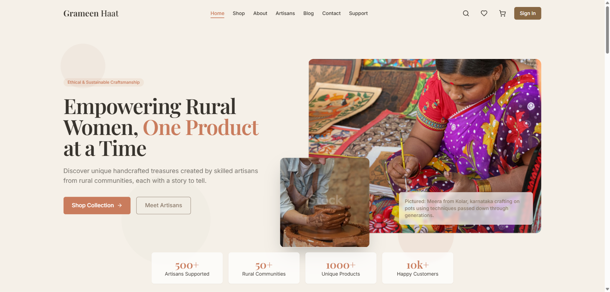
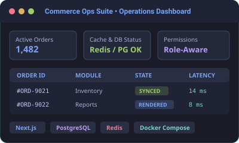
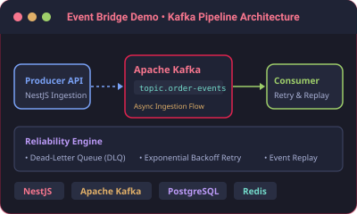

# Parvej Ali

**Software Engineer**

I build product interfaces and backend systems that stay fast, reliable, and easy to reason about after they ship.

[Portfolio](https://parvejali.vercel.app) &nbsp;•&nbsp; [LinkedIn](https://linkedin.com/in/parvej-ali) &nbsp;•&nbsp; [GitHub](https://github.com/ParvejAliDev)

---

### 🛠️ Skills & Technologies

  

- **Frontend Craft**: `Next.js` · `React` · `TypeScript` · `HTML5 / CSS3` · `Component Architecture` · `Client Performance`
- **Backend & Systems**: `Node.js` · `NestJS` · `TypeScript` · `REST APIs` · `Apache Kafka`
- **Databases & Caching**: `PostgreSQL` · `Redis`
- **DevOps & Infrastructure**: `Docker` · `Docker Compose` · `AWS` · `GitHub Actions` · `Git`

---

### Focus

- **Frontend & Interface Craft**: Designing fluid UI interactions, responsive component architectures, state management, and client rendering performance.
- **Backend & System Depth**: Building resilient API contracts, event processing pipelines, data access layers, and caching strategies.
- **End-to-End Product Workflows**: Connecting client interface states directly to backend database execution into fast, operable software.

---

### Selected Systems

| Preview | Project & System Details |
| :---: | :--- |
|  | **🌾 <a href="https://grameenhaat.netlify.app/" target="_blank" rel="noopener noreferrer">Grameen Haat</a>** Full-stack e-commerce marketplace platform built with `Node.js`, `Express`, `TypeScript`, `MongoDB`, `React`, `Vite`, and `Tailwind CSS`. • Multi-role marketplace ecosystem for artisans, customers, vendors, and admins with RBAC. • Production Express REST backend with MongoDB atomic transactions, Joi validation, & Swagger API docs. • Dynamic client interface powered by TanStack Query, Stripe, and Cloudinary. |
|  | **📦 <a href="https://github.com/parvejalidev/commerce-ops-suite" target="_blank" rel="noopener noreferrer">Commerce Ops Suite</a>** Local-first internal operations dashboard built with `Next.js`, `TypeScript`, `PostgreSQL`, `Redis`, and `Docker Compose`. • Server-side loading patterns & client state management for data-heavy internal workflows. • Role-aware workspace permissions for orders, reports, and administrative tasks. • Reproducible local runtime designed for direct technical walkthroughs. |
|  | **⚡ <a href="https://github.com/parvejalidev/event-bridge-demo" target="_blank" rel="noopener noreferrer">Event Bridge Demo</a>** Event-driven system demo built with `NestJS`, `Apache Kafka`, `PostgreSQL`, `Redis`, and `Docker Compose`. • Asynchronous message ingestion and topic consumer processing flow. • Dead-letter queue (DLQ) handling, failure retry loops, and event replay paths. • Smoke-testable local infrastructure with observable reliability behavior. |
